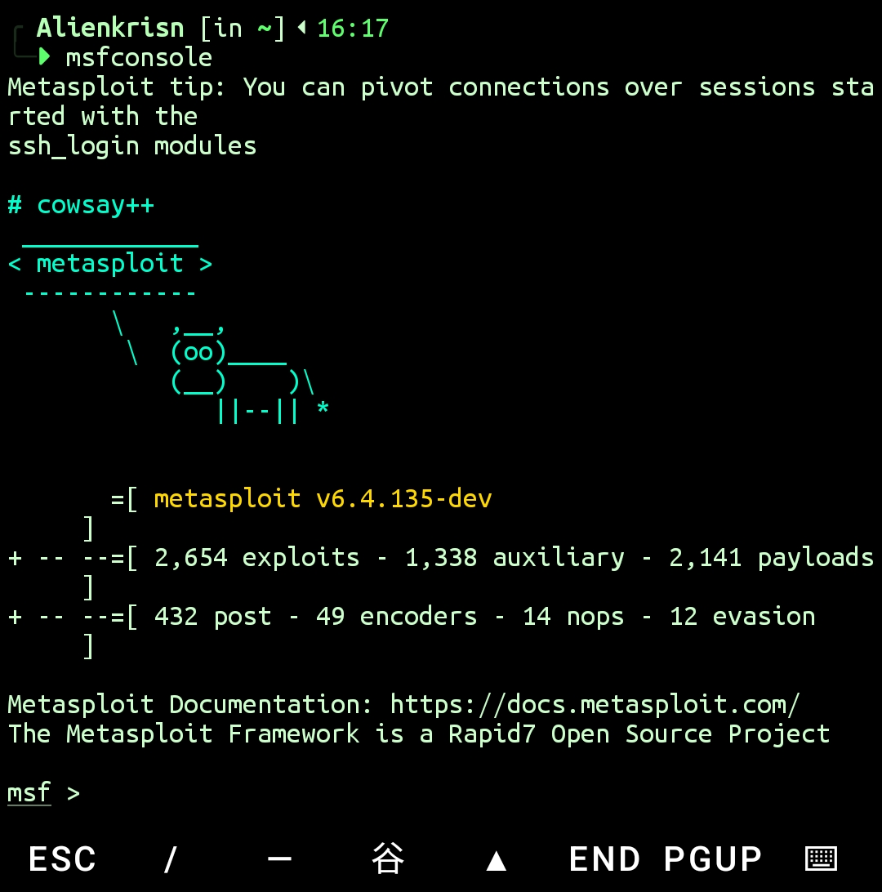

<div align="center">


# 🦠 Metasploit Termux

**Metasploit Framework 6.4.135 for Termux — Simple, patched, and working.**

[](#-about)
[](#-installation)
[](#-about)

<br>

<details>
<summary><b>📸 Click to view screenshot</b></summary>
<br>

</details>

<br>

</div>

---

## 📋 About

A simple and reliable script to install the **Metasploit Framework 6.4.135** directly on your Android device via Termux. 

Unlike other buggy scripts, this installer includes **actual patches**—such as fixing the notorious `nokogiri gumbo parser error`—to ensure Metasploit runs smoothly in the Termux environment. As a bonus, it also automatically installs **apktool** for your Android payload crafting needs.

> [!WARNING]
> **Disclaimer:** Metasploit is a powerful penetration testing tool. This script was built for educational purposes and authorized security testing only. The author is **not responsible** for any misuse, illegal activities, or damage caused by this tool. Always obtain explicit permission before testing any systems or networks.

---

## 🚀 Installation

Run the following command in your Termux terminal:

```bash
curl -sL https://github.com/Alienkrishn/metasploit-termux/raw/main/msf_termux.sh | bash
```

Sit back and let the script handle the dependencies, patches, and setup process.

---

## 🗑️ Uninstall

If you ever need to remove Metasploit from your Termux environment, simply run:

```bash
curl -sL https://github.com/Alienkrishn/metasploit-termux/raw/main/msf_uninstall.sh | bash
```

---

> [!NOTE]
> Make sure you are using a clean and updated Termux environment (`pkg update && pkg upgrade`) before running the installation for the best experience.

---

<div align="center">

**Author: Alienkrishn [Anon4you]**

</div>
